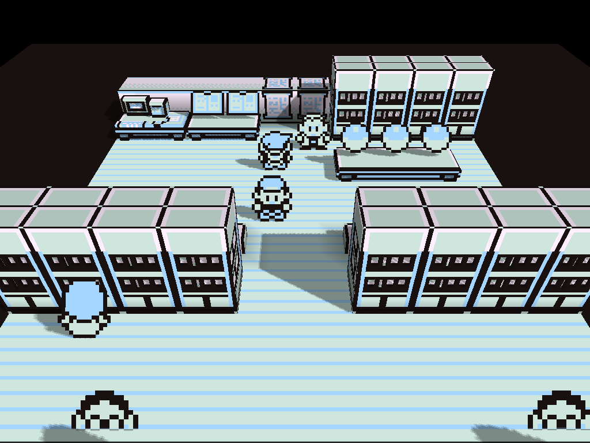

# Gen1Recomp for NextUI

**Play Pokémon Red, Blue and Yellow natively on the TrimUI Brick, Smart Pro and Smart Pro S** — no emulator, and optionally with a 3D voxel overworld.



*Captured on a TrimUI Brick at its native 1024×768, with the optional [3D voxel mod](#3d-voxel-mod) enabled. The 2D game looks exactly like the original.*

This is a [NextUI](https://github.com/LoveRetro/NextUI) pak that packages [Gen1Recomp](https://github.com/bryanthaboi/gen1recomp), a from-scratch recreation of the Generation 1 Pokémon games written in Lua on the LÖVE engine. It runs as native ARM64 code at your handheld's own resolution and frame rate, rather than emulating a Game Boy.

> **Status: verified on a TrimUI Brick and a Smart Pro S.** The runtime, ROM import, 2D game, voxel mod, controller mapping and audio have all been exercised on real hardware. The Smart Pro and Brick Pro are untested — see [Tested on](#tested-on).

## What this is, and what it is not

**It is** a repackaging of Gen1Recomp for NextUI: the LÖVE 11.5 ARM64 runtime, the game engine, and a launcher that handles the device-specific setup (GLES, audio routing, controller mapping, CPU behaviour).

**It is not:**

- **An emulator.** No Game Boy hardware is simulated. The game logic is original Lua code.
- **A ROM, or a source of one.** Nothing here contains game data. You supply your own cartridge dump, which is read exactly once.
- **A ROM hack or a translation patch.** Nothing is patched.
- **Affiliated with `gen1recomp.com`.** Upstream's README states that site is unaffiliated with the project and impersonating it. The real project is [`bryanthaboi/gen1recomp`](https://github.com/bryanthaboi/gen1recomp).

Credit for the game itself belongs entirely upstream. This repository is packaging.

## Requirements

- **NextUI** on a TrimUI device — `tg5040` (Brick, Smart Pro, Brick Pro) or `tg5050` (Smart Pro S)
- **Your own US Red, Blue or Yellow cartridge dump.** Only the three canonical 1 MiB US ROMs are accepted; the engine verifies by SHA-1 and refuses anything else
- ~34 MB of card space, or ~15 MB if you build without the 3D mod
- For the 3D voxel mod: [Swap.pak](https://github.com/carroarmato0/NextUI-Swap-Pak). See [3D voxel mod](#3d-voxel-mod)

## Install

**Pak Store** (easiest): find **Gen1Recomp** and install.

**Manual, from a release:**

- `Gen1Recomp.pakz` — unzip at the root of your SD card. This lays out both platforms, ready to go.
- `Gen1Recomp.pak.zip` — extract into the platform folder yourself:

```
/mnt/SDCARD/Tools/tg5050/Gen1Recomp.pak/    # or tg5040
```

Then open **Tools → Gen1Recomp**.

That is the whole install. There is no ROM folder to create and no stub file to place — the pak is self-contained and imports your dump from wherever you already keep it.

### Upgrading from v0.1.0

v0.1.0 was an Emu pak. That needed a `Roms/Gen1Recomp (Gen1Recomp)/` folder containing a 0-byte `Gen1Recomp.g1r` file before NextUI would show anything at all, and anyone whose card did not end up with both saw no entry under Games. It is a Tool pak now, so there is nothing to create.

**The first launch cleans up after itself.** `Roms/Gen1Recomp (Gen1Recomp)/` is deleted, because everything in it came from this project — the 0-byte stub, and a `.media/README.txt` explaining where box art goes — and leaving it behind means a second Gen1Recomp under Games that runs the old copy. If you put your own box art in that folder, it goes too; the log names the folder before removing it.

One thing is left for you:

```
/mnt/SDCARD/Emus/<platform>/Gen1Recomp.pak/     # ~31 MB, no longer read by anything
```

Deleting the ROM folder already removes the stale entry, so this is only disk space — and removing a whole installed pak on your behalf is a bigger assumption than this pak should make. The log names the path.

**Your saves are not affected.** They have always lived in `.userdata/shared/Gen1Recomp/`, which none of this touches.

## First run: your ROM

Gen1Recomp needs a cartridge dump **once**. It verifies the ROM, decodes the game data into its own cache, and never reads the ROM again.

So you do not need to move or copy anything. **Leave your dump where you already keep it** — the pak scans your own Game Boy folders on launch and copies what it finds into the place the engine expects.

It looks in whichever folders NextUI itself considers Game Boy or Game Boy Color: the ones whose name ends in `(GB)` or `(GBC)`, plus a folder named exactly `GB` or `GBC`. The display name in front of the tag is yours — `Game Boy (GB)`, `Nintendo Game Boy (GB)` and `GB` all work, because that is the same rule the frontend uses to decide which emulator opens a ROM.

It hashes the `.gb`/`.gbc` files it finds and copies every version that matches into the engine's import folder. Your file is only ever read: never moved, renamed or modified.

The scan tracks each version separately, so **you can add a version later**: import Red today, drop a Yellow dump on the card next month, and the next launch picks it up. A version already imported is left alone, and once all three are in the scan stops running altogether. Only files of exactly 1 MiB are hashed — the engine accepts no other size — so a large homebrew library costs little.

Accepted dumps (1 MiB US cartridges only). Check yours on the device with `sha256sum <file>`:

| Version | SHA-256 |
|---|---|
| Red | `5ca7ba01642a3b27b0cc0b5349b52792795b62d3ed977e98a09390659af96b7b` |
| Blue | `2a951313c2640e8c2cb21f25d1db019ae6245d9c7121f754fa61afd7bee6452d` |
| Yellow | `8cbaa499397e4f1a679c992ea9382a2dd7942ab398b48c19829c2d9529de47bf` |

SHA-256 rather than the SHA-1 upstream publishes, because these handhelds ship `sha256sum` but not `sha1sum`. The engine still runs its own SHA-1 verification when it imports, so a dump has to satisfy both.

**If nothing matches**, the pak still starts the game and lets Gen1Recomp's own launcher take over, where its *Choose ROM* screen explains what to do. You get an explanation on screen rather than a black one. The log lists which folders were searched.

Other regions, revisions and ROM hacks are not supported by the engine.

## 3D voxel mod

The 3D look most people associate with Gen1Recomp is **not** part of the game — it comes from a separate, experimental mod, **DramaticShapeVoxelMod**, which replaces the flat overworld with a voxel one and adds camera depth, shadows and 3D battle presentation.

It **ships with this pak but is switched off by default.** Enable it from the in-game mod manager (`OPTIONS → mods`, or `F10` on a keyboard).

It is off by default for one specific reason: **memory.**

### Memory: Swap.pak is required, not optional

Measured across a session on a Smart Pro S (962 MB RAM), voxel mod on:

| Point in session | LÖVE RSS | Free | Paging |
|---|---|---|---|
| Start | 151 MB | 619 MB | none |
| A few minutes in | 524 MB | 143 MB | none |
| Later | **722 MB** | 35 MB | **22 of 30 samples** |

At the end: `VmPeak` 1.58 GB virtual, 108 MB actually swapped out, and `pswpout` spikes of up to 4,730 pages per sample. **The 1 GB swap is the only reason it was not OOM-killed.**

So: **install [Swap.pak](https://github.com/carroarmato0/NextUI-Swap-Pak) before using the voxel mod.** 512 MB on internal storage, boot hook enabled. Internal rather than the card matters here — swap-in runs ~17.3 MB/s internally against ~2.8 MB/s from an SD card.

This README previously said the mod peaked around 183 MB and that swap was probably unnecessary. That was drawn from a single early sample and was wrong; the figure climbs steadily with play and the ~750 MB reported by the nx-redux project is accurate.

It is not a leak. The mod caches meshes per map and evicts down to a live set of the current map plus connected neighbours, so the working set is bounded — but on a large, well-connected outdoor area that bound is around 700 MB. Expect indoor and small maps to be far lighter, and expect the worst on open routes.

Once it starts paging, the stalls are disk waits and no graphics setting will touch them. Swap keeps the session alive; it does not make it smooth.

### Recommended settings

Short version: **install Swap.pak, and leave the in-game settings alone.** Everything that measurably helps, the pak already does for you.

| Setting | Recommendation | Why |
|---|---|---|
| **Swap.pak** | **Required** for the voxel mod. 512 MB, internal storage, boot hook on | RSS reaches ~700 MB on a 962 MB device and pages regardless of any setting we found. Without swap the session is OOM-killed |
| **MAX FPS** | Leave at 60 | 30 vs 60 measured identical. The cap only binds when frames are produced *faster* than the target, and neither device reaches 30 with the mod on |
| **PERFORMANCE** | Leave at **AUTO** | Already resolves to `LOW` on ARM Linux. Setting it explicitly changes nothing |
| **VOID FILL** | Try **BLACK** only if you are paging | Inconsistent: ~133 MB saved on a Brick, only ~28 MB on a Smart Pro S, which kept paging anyway. See below |

Automatic, no action needed: all CPU cores brought online, cluster frequency ceilings raised, and on big.LITTLE hardware every LÖVE thread pinned to the big cluster — worth about 16 points of GPU utilisation on the Smart Pro S.

**On VOID FILL, and a measurement caveat worth stating.** The Brick showed peak RSS falling from 386 MB to 253 MB with BLACK, which looked like a solid win. It did not replicate on the Smart Pro S: 722 MB to 694 MB, still paging. The likely explanation is that the two Brick runs were not comparable — one began mid-session at 385 MB, the other from a fresh launch at 233 MB — and what I was really measuring was **how many maps had been visited**, not the void fill.

That is the more useful finding: memory scales with the maps in the mod's live set (current map, its connected neighbours, and the previous set), so a long trek costs far more than any graphics option saves. If you are paging, quitting and relaunching reclaims more than VOID FILL does.

There is no in-game FPS counter to compare against: it was requested twice upstream ([#963](https://github.com/bryanthaboi/gen1recomp/issues/963), folded into [#225](https://github.com/bryanthaboi/gen1recomp/issues/225)) and closed `not_planned`. That is why `scripts/profile-device.sh` measures GPU utilisation, CPU and memory rather than frame rate — those are the only signals the device actually exposes.

Every figure here is one or two runs on one or two devices. Treat the directions as real and the exact numbers as indicative, and measure your own with `scripts/profile-device.sh 60`.

**The pak does not write any of these for you.** It could — the engine merges a partial `options.lua` over its defaults, so seeding on first run would be safe. It does not, because nothing we measured justifies it: the two settings that would have been invisible technical wins do nothing, and the one with any effect is a visible change with an unreliable payoff.

### Why the mod's update check fails

Two separate things, worth telling apart:

**Certificates.** These handhelds ship no CA store at all, and the engine does HTTPS by shelling out to `curl`. Every request therefore failed verification (`curl` exit 60), which the mod manager reported simply as a failed check. This pak ships a CA bundle and points `curl` at it, so HTTPS works.

**The mod's repository is gone.** `DramaticShape/DramaticShapeVoxelMod` returns 404, so its update check fails even with working TLS — there is nothing left to check against. That is not something this pak can fix, and it does not stop the mod working. The copy bundled here (1.7.2) comes from a community archive.

So: a failed update check on the voxel mod specifically is expected. The mod itself still loads and runs.

### Performance: the bottleneck differs by device

Measured with `scripts/profile-device.sh`, sampling only while rendering.

**TrimUI Brick** (A133, PowerVR GE8300, 4 cores) — **GPU-bound:**

| Setting | GPU median | GPU p75 |
|---|---|---|
| MAX FPS 60 | 91% | 96% |
| MAX FPS 30 | 92% | 99% |

Capping the frame rate changed nothing, and that is worth understanding rather than retrying. The cap is a sleep budget in the run loop, so it only binds when frames are produced *faster* than the target. With the GPU pinned near 99% under a 30 cap, the device is already below 30 fps and there is nothing to hold back — and 30 is the floor of the ladder (`FrameCap.MIN`). An earlier version of this README recommended capping at 30 as the biggest win; measurement says it is not.

**TrimUI Smart Pro S** (sun55iw3, Mali-G57 single core, 8 cores, big.LITTLE) — **not GPU-bound, until it runs out of memory:**

| | GPU median | GPU p75 | System CPU p75 |
|---|---|---|---|
| Default scheduling | 67% | 72% | 19% |
| Threads pinned to the big cluster | **83%** | **88%** | 20% |

NextUI leaves only three cores online and the scheduler parked LÖVE's main thread — the one driving rendering — on a *little* core at 936 MHz while the big cluster idled at 2160 MHz. This pak now brings all eight cores online and pins every LÖVE thread to the big cluster with a cpuset, which lifted GPU utilisation by about 16 points: more frames getting through.

(That comparison is imperfect. The pinned run was also deep enough into the session to be swapping, so some of the difference is confounded by memory pressure.)

On both devices the CPU as a whole is nowhere near saturated — 19–39% across all cores. Single-thread speed and thread placement matter; total CPU capacity does not.

The one lever that matters is **swap** — on the Smart Pro S memory is the binding constraint, not the GPU. VOID FILL = BLACK helps inconsistently and does not move the frame rate; the mod's mesh ring is a hardcoded constant, so draw distance is not adjustable. See [Recommended settings](#recommended-settings).

Be realistic: this is a 3D renderer on budget handheld silicon. The 2D game runs comfortably on both.

## Controls

Standard Game Boy controls. **Physical A confirms**, matching the rest of NextUI, rather than SDL's positional default which would put confirm on B.

| Action | Button |
|---|---|
| Move | D-pad / left stick |
| A | A |
| B | B |
| Start / Select | Start / Select |

Everything is rebindable in-game under `OPTIONS → CONTROLS`.

Prefer the positional (Xbox) layout? Create an empty file named `xbox_layout` in `/mnt/SDCARD/.userdata/shared/Gen1Recomp/` and the override is skipped.

## Saves

Saves, options and the ROM-derived cache live in:

```
/mnt/SDCARD/.userdata/shared/Gen1Recomp/
```

Deliberately outside the pak directory, so **updating or reinstalling the pak does not touch your saves.** (Upstream's portable-mode marker, which would put them next to the game files inside the pak, is removed at build time for exactly this reason.)

## Limitations

Stated plainly, because these are structural rather than bugs, and knowing them up front is cheaper than discovering them.

### On the device

- **MENU does not quit the game.** NextUI does not intercept MENU for standalone applications, so it arrives as an ordinary button. Quit through Gen1Recomp's own launcher.
- **Sleep does not work.** All power handling lives inside the NextUI frontend, which has exited while the game runs. Brightness and volume *do* keep working — a background daemon handles those.
- **The pak changes CPU state while running.** It brings all cores online, raises cluster frequency ceilings, and on big.LITTLE hardware pins LÖVE to the big cluster. Governor, ceilings, floors and which cores are online are all recorded at launch and put back on exit. The online mask is the one that matters: NextUI offlines five of the Smart Pro S's eight cores at boot and never repeats it, so a core left up by this pak would stay up for the rest of your session. Create `no-cpu-tuning` in the state dir to disable.

### The voxel mod

- **It is not smooth, and no setting fixes that.** On a Brick it is GPU-bound at 91–99% and renders below 30 fps. On a Smart Pro S the GPU has headroom but memory does not. The 2D game runs comfortably on both.
- **It needs swap.** ~700 MB working set on a ~960 MB device. Without [Swap.pak](https://github.com/carroarmato0/NextUI-Swap-Pak) the session is eventually OOM-killed.
- **Its update check always fails.** The mod's repository (`DramaticShape/DramaticShapeVoxelMod`) returns 404, so there is nothing to check against. Unrelated to the TLS fix this pak ships, and it does not stop the mod working.
- **It is pinned at 1.7.2** — the newest version the community archive holds. Later versions are referenced elsewhere but are not obtainable from any source we can verify.
- **Draw distance is not adjustable.** The mesh ring is a hardcoded constant, not an option, whatever third-party guides claim.

### Measurement

- **There is no in-game FPS counter**, and none is planned ([#225](https://github.com/bryanthaboi/gen1recomp/issues/225) closed `not_planned`). `scripts/profile-device.sh` reports GPU utilisation, CPU and memory instead, because that is what the device exposes.
- **Performance figures here are one or two runs on one or two devices.** Directions are trustworthy; exact numbers are indicative. Three recommendations in this project were withdrawn after wider measurement — cap FPS at 30, swap unnecessary, VOID FILL saves memory — so treat single-run results, including ours, with suspicion.

### Scope

- **Only canonical US Red, Blue and Yellow are accepted.** Other regions, revisions and ROM hacks are refused by the engine, not by this pak.
- **Two of four devices are untested.** The Smart Pro and Brick Pro share a platform with the Brick and are likely fine, but nobody has run them. See [Tested on](#tested-on).
- **Updating from v0.1.0 deletes `Roms/Gen1Recomp (Gen1Recomp)/`, box art included.** That folder was entirely this project's doing and leaves a stale duplicate entry otherwise. The old pak under `Emus/` is left for you to remove. See [Upgrading from v0.1.0](#upgrading-from-v010).
- **A `.love` file dropped in the state directory will run instead of the game**, but that is a diagnostics hook for the smoke test, not a feature. There is no per-game save isolation or controller profile behind it; this pak is Gen1Recomp-specific. Delete it to get the game back.
- **The bundled CA certificate bundle is pinned and will age.** Roots expire, and a stale bundle fails exactly as silently as having none. Refresh with `scripts/build.sh --refresh-ca`.
- **Upstream has an AI-generated-code controversy attached.** It changes nothing technically and this pak takes no position; it is mentioned so the decision is yours rather than a surprise.

## Troubleshooting

Every launch overwrites a log:

```
/mnt/SDCARD/.userdata/<platform>/logs/Gen1Recomp.txt
```

It records the platform, resolved paths, memory and swap state, what the CPU section did, and the entire ROM scan. Over ADB:

```sh
adb shell cat /mnt/SDCARD/.userdata/tg5050/logs/Gen1Recomp.txt
```

| Symptom | Look for |
|---|---|
| Nothing happens when launched | `FATAL` in the log — usually an incomplete install |
| Two Gen1Recomp entries, one under Games | A leftover v0.1.0 install. The `legacy` lines say what was removed and what is left |
| Game asks for a ROM you already have | `rom` lines: the scan reports every folder it searched, and says so explicitly when it found no Game Boy folder at all |
| Audio crackles or distorts | `XRUN`. Try removing `no-cpu-tuning` from the state dir if you created it |
| Killed during a voxel session | `SwapTotal` in the log. Set up Swap.pak as above |
| A and B feel swapped | The controller GUID may differ on your unit — see [Contributing](#contributing) |

Two lines in the log look like errors and are not. `libz.so.1: no version information available` is a symbol-versioning notice from the firmware's zlib. `AL lib: (EE) mmap commit error: Broken pipe` appears a handful of times as OpenAL starts; a Brick session with ten of them had audio working normally throughout. Neither indicates a problem on its own.

## Tested on

Honest status. An untested device is listed as untested, not assumed to work.

| Device | Platform | Screen | Status |
|---|---|---|---|
| TrimUI Brick | `tg5040` | 1024×768 | **Runs.** GLES 3 context, ROM import, 2D game, voxel mod, controller mapping (A confirms) and audio all verified on hardware. Re-verified as a Tool pak on v0.2.0: launches from Tools, imports both Red and Blue out of an 89-ROM library, removes a v0.1.0 ROM folder without touching any of 1061 save files, and returns cleanly to the frontend |
| TrimUI Smart Pro | `tg5040` | 1280×720 | Not tested — same platform as the Brick, so likely fine, but unverified |
| TrimUI Brick Pro | `tg5040` | 1024×768 | Not tested |
| TrimUI Smart Pro S | `tg5050` | 1280×720 | **Runs.** Profiled with the voxel mod; needs swap. Audio verified. Yellow import verified end to end on hardware: a dump added after Red and Blue were already imported is picked up on the next launch and decoded (cache complete in ~50 s) |

The runtime itself is known to work on this hardware class — the LÖVE 11.5 ARM64 build here is the same one shipped by [PortMaster](https://portmaster.games/), and [nx-redux](https://github.com/mohammadsyuhada/nx-redux) runs Gen1Recomp with the voxel mod on both platforms. What is untested is *this pak*.

## Building from source

No compiler and no cross-toolchain. Everything is fetched from pinned, hash-verified upstream artifacts and rearranged.

There is genuinely nothing to compile: Gen1Recomp is LÖVE 11.5 / LuaJIT, so the game is Lua and upstream's `.love` **is** the from-source build. That is where the game payload comes from. The RG34XXSP port zip is fetched only for the aarch64 LÖVE runtime — the exact build upstream tested this game version against — and its LÖVE licence file.

```sh
scripts/build.sh                 # fetch + stage into build/Gen1Recomp.pak/
scripts/build.sh --no-voxel      # skip the voxel mod (~19 MB of the 34 MB pak)
scripts/verify.sh                # static + contract checks
test/test-launch.sh              # launch.sh behaviour against a fake SD card
scripts/release.sh               # -> dist/Gen1Recomp.pak.zip and dist/Gen1Recomp.pakz
scripts/deploy.sh                # adb push to a device
scripts/verify-device.sh         # the real functional test, on hardware
scripts/profile-device.sh 60     # sample GPU/CPU/memory while playing
```

Needs `curl`, `jq`, `zip`, `unzip`, `sha256sum`, `readelf`.

`upstream.lock` pins every third-party artifact by SHA-256 and every assumption the launcher makes about upstream's payload. `verify.sh` re-checks all of it, so an upstream change that would break the pak fails the build with a name attached instead of producing a black screen on your device. A scheduled workflow watches upstream for new releases and prepares a **draft** release plus a device checklist — it never publishes, because CI cannot test any of what matters.

## Contributing

The most useful thing you can contribute is a **device report** — especially on a **Smart Pro** or **Brick Pro**, neither of which has ever been run on hardware. There is an issue template for it, and "it just works" is as useful as a bug.

If you can, include `scripts/profile-device.sh 60` output. Everything this README claims about performance rests on one or two runs on one or two devices, so a second data point genuinely changes what it says.

If A and B are swapped for you, the controller GUID in `launch.sh` is wrong for your unit — the smoke test prints the real one, and that is exactly the fix to send.

## Credits and licences

This pak is **MIT**. It bundles:

- **[Gen1Recomp](https://github.com/bryanthaboi/gen1recomp)** by bryanthaboi — MIT. The actual game; version **0.1.77** is bundled here. Upstream credits the [pret](https://github.com/pret) group's `pokered` disassembly as making the project possible.
- **[LÖVE](https://love2d.org/) 11.5** — zlib. The ARM64 build comes from **[PortMaster](https://portmaster.games/)**, which is why this pak needs no compiler.
- **DramaticShapeVoxelMod** 1.7.2 — the 3D mod. Its original repository is no longer available; the copy used here comes from the community archive [`linkfy/DramaticShapeVoxelModBackup`](https://github.com/linkfy/DramaticShapeVoxelModBackup).
- **[NextUI](https://github.com/LoveRetro/NextUI)** — the firmware this targets.
- **[Swap.pak](https://github.com/carroarmato0/NextUI-Swap-Pak)** — recommended for the voxel mod. The swap performance figures quoted above are its measurements.

The TrimUI-specific settings in `launch.sh` — the controller GUID, the audio routing, the CPU behaviour behind the audio fix — were worked out first by **[nx-redux](https://github.com/mohammadsyuhada/nx-redux)** (GPL-3.0). This pak was written independently from those published findings; no code was copied, and the credit for figuring them out is theirs.

Pokémon is a trademark of Nintendo/Creatures/GAME FREAK. This project is unaffiliated, ships no copyrighted game content, and requires you to supply your own legally obtained cartridge dump.
